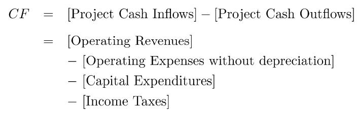
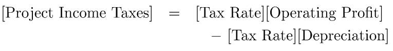
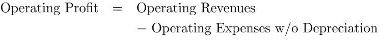
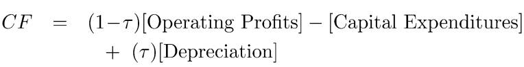
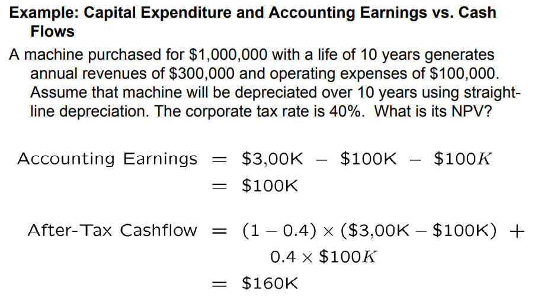

# Capital Budgeting

# NPV 准则

## 规则

> [!note]
> **NPV Rule:** 增加企业市值 `Market Value`，首先就得保证公司项目的 NPV 为正。

公司项目的现金流为

$$
\{ CF_0, CF_1,\dotsm,CF_T \}
$$

当前项目的净现值就是

$$
\text{NPV} = CF_0 + \frac{CF_1}{1+r_1} + \dotsm + \frac{CF_T}{(1+ r_T)^T}
$$

**决定公司未来发展哪些项目时，就需要考虑将 NPV 最大化（公司不是搞慈善，得赚钱）**
- 投资单一项目：只有项目的 NPV 为正，才接受
- 投资多个独立项目：接受所有 NPV 为正的项目
- 投资多个非独立项目：选择 NPV 最大的项目组合方案

## 现金流计算

现金流计算需要关注的点：
1. 现金流不是收益，经济决策不关注收益（**收益是决策真正执行完成后才有的**）
2. 现金流为税后结果
3. 现金流需要考虑全面，可能会有遗漏

- `Operationg Revenues` : 营业收入
- `Operating Expenses without depreciation` : 不考虑折旧的运营支出
- `Capital Expenditures`: 资产支出，例如花费买新设备
- `Income Taxes` : 所得税

    

- `Depreciation`: 折旧，描述资产贬值，例如生产设备放厂里也会随时间贬值。**本质是一个税盾 `tax shield`，这部分不用交税**
- `Operating Profits` : 营收利润，营业收入减去不考虑折损的运营支出

    

综上，就能得出现金流的计算公式

- $\tau$ : 表示税率

> [!note]
> 资产的折旧只影响现金流中的税额，并不会直接参与现金流计算，因为折旧即不属于现金流的流入部分，也不属于流出部分。

## 折扣率

公司开展的具体项目可以看做是公司发行了一支股票。既然是投资了一个股票，那么就存在风险。风险高，股票的价格也就越低，即该项目的 NPV 值也就越低。股票的风险都是体现在贴现率上的，项目也是一样。项目的贴现率也称之为资产成本 `Cost of Capital`，该值可以通过 `CAPM` 模型进行估算

$$
\bar{R}_\text{project} =  R_f+\beta_\text{project}\left(\bar{R}_m-R_f\right)
$$

其中 $\beta_\text{project}$ 值可以参考其他公司的类似项目。
